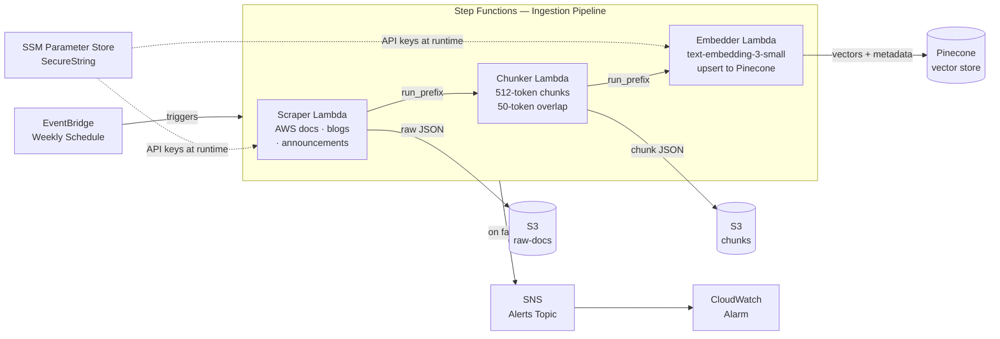
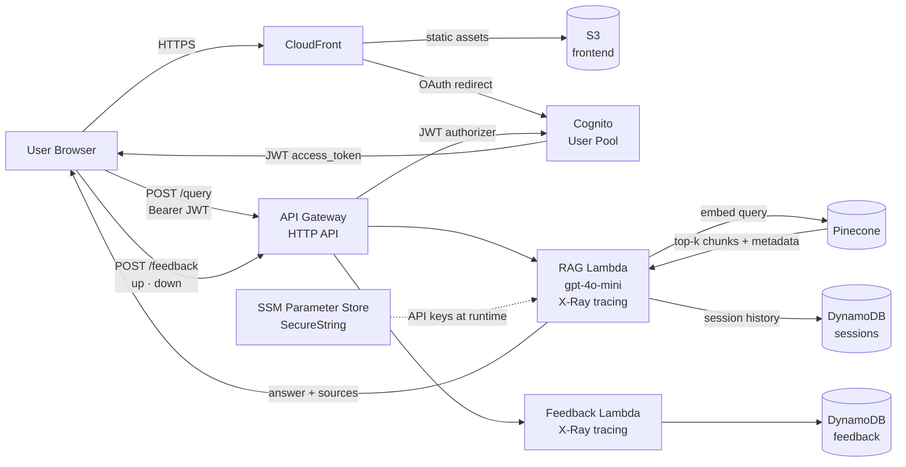

# AWS RAG Chatbot

A fully serverless RAG (Retrieval-Augmented Generation) chatbot that answers AWS architecture questions. Recursively crawls official AWS documentation (Well-Architected Framework, CloudFront, Lambda, S3, DynamoDB, API Gateway, VPC), AWS blog posts, and announcements on a weekly schedule, embeds them into a Pinecone vector store, and serves answers with cited sources through a React frontend.

## Architecture

### Ingestion Pipeline



### Query Flow



## Tech Stack

| Layer | Technology |
|---|---|
| Frontend | React 18, Vite, sessionStorage JWT |
| CDN / Hosting | CloudFront (OAC) + S3 (private) |
| Auth | Amazon Cognito, OAuth 2.0 PKCE (code flow) |
| API | API Gateway HTTP API (JWT authorizer) |
| Compute | AWS Lambda (Python 3.12) |
| Orchestration | AWS Step Functions |
| Scheduling | Amazon EventBridge (weekly cron) |
| Vector store | Pinecone |
| LLM / Embeddings | OpenAI gpt-4o-mini + text-embedding-3-small via LiteLLM |
| Storage | Amazon S3 (raw docs, chunks, frontend) |
| Sessions / Feedback | Amazon DynamoDB (PITR enabled) |
| Secrets | AWS SSM Parameter Store (SecureString, TTL-cached) |
| Observability | CloudWatch, X-Ray (active tracing), SNS alerts |
| Evaluation | RAGAS (faithfulness, answer relevancy, context recall) |
| IaC | Terraform >= 1.7 |
| Testing | pytest, moto |

## Project Structure

```
.
├── src/
│   ├── ingestion/
│   │   ├── scraper.py        # Recursively crawls AWS docs, blogs, announcements
│   │   ├── chunker.py        # 512-token sliding-window chunker (tiktoken)
│   │   └── embedder.py       # Embeds chunks and upserts to Pinecone
│   ├── query/
│   │   └── rag.py            # RAG handler + feedback handler
│   ├── evaluation/
│   │   └── ragas_eval.py     # RAGAS evaluation pipeline
│   └── utils/
│       └── ssm.py            # TTL-aware SSM secret cache (5 min)
├── tests/
│   ├── ingestion/            # Unit tests for scraper, chunker, embedder
│   ├── query/                # Unit tests for RAG and feedback handlers
│   └── evaluation/           # Unit tests for RAGAS eval
├── frontend/
│   ├── src/
│   │   ├── App.jsx           # Root component, auth flow
│   │   ├── api.js            # API client (fetch + JWT injection)
│   │   ├── auth.js           # Cognito OAuth helpers
│   │   └── components/
│   │       ├── ChatMessage.jsx
│   │       └── Sources.jsx
│   └── index.html
├── terraform/
│   ├── main.tf               # Root module wiring
│   ├── variables.tf
│   ├── outputs.tf
│   ├── providers.tf          # AWS provider + remote state config
│   └── modules/
│       ├── auth/             # Cognito user pool + client + domain
│       ├── frontend/         # S3 + CloudFront (OAC)
│       ├── ingestion/        # Lambdas, S3 buckets, Step Functions, EventBridge
│       ├── monitoring/       # SNS topic + CloudWatch alarm
│       ├── query-api/        # API Gateway, RAG/feedback Lambdas, DynamoDB
│       └── secrets/          # SSM parameter path outputs (no values in state)
├── scripts/
│   ├── setup-secrets.sh      # Pre-deploy: creates SSM SecureString params
│   └── build-lambdas.sh      # Bundles Python deps into Lambda zips
├── docs/
│   └── deployment.md         # Full deployment walkthrough
├── pyproject.toml
└── conftest.py
```

## Prerequisites

- AWS CLI configured (`aws configure`)
- Terraform >= 1.7
- Node.js >= 18 and npm
- Python 3.12
- [OpenAI API key](https://platform.openai.com)
- [Pinecone API key](https://app.pinecone.io) + index named `aws-rag` (dimension: 1536, metric: cosine, type: dense)

## Quick Start

### 1. Store secrets out-of-band

```bash
chmod +x scripts/setup-secrets.sh
./scripts/setup-secrets.sh
```

This creates two SSM SecureString parameters:
- `/rag-chatbot/openai_api_key`
- `/rag-chatbot/pinecone_api_key`

### 2. Build Lambda packages

Dependencies must be bundled before Terraform can zip and deploy them:

```bash
chmod +x scripts/build-lambdas.sh
./scripts/build-lambdas.sh
```

### 3. Deploy infrastructure

```bash
cd terraform
terraform init
terraform apply
```

Outputs include `cloudfront_domain`, `api_endpoint`, `cognito_user_pool_id`, `cognito_client_id`, and `state_machine_arn`.

### 4. Build and deploy frontend

```bash
cd frontend
cp .env.example .env
# Fill VITE_COGNITO_DOMAIN, VITE_COGNITO_CLIENT_ID, VITE_API_URL with terraform outputs
npm install
npm run build

BUCKET=$(terraform -chdir=../terraform output -raw cloudfront_domain | xargs -I{} \
  terraform -chdir=../terraform output -raw site_bucket)
aws s3 sync dist/ s3://$BUCKET --delete
```

See [docs/deployment.md](docs/deployment.md) for the full step-by-step guide.

## Local Development

### Python (backend / tests)

```bash
python3 -m venv .venv && source .venv/bin/activate
pip install -e ".[dev]"
pytest tests/ -v --tb=short
```

### Frontend

```bash
cd frontend
npm install
npm run dev   # http://localhost:5173
```

## Evaluation

RAGAS evaluation runs against stored DynamoDB sessions:

```bash
# Requires live AWS credentials and populated sessions table
python -m src.evaluation.ragas_eval
```

Metrics: **faithfulness**, **answer_relevancy**, **context_recall**

## Configuration

All secrets are stored in SSM Parameter Store — no `.env` files needed in production.

| SSM Path | Description |
|---|---|
| `/rag-chatbot/openai_api_key` | OpenAI API key |
| `/rag-chatbot/pinecone_api_key` | Pinecone API key |

Lambda environment variables (non-secret) are managed by Terraform.

## Contributing

1. Fork the repo and create a feature branch
2. Write tests first (`pytest tests/`)
3. Ensure `terraform validate` passes
4. Open a pull request
