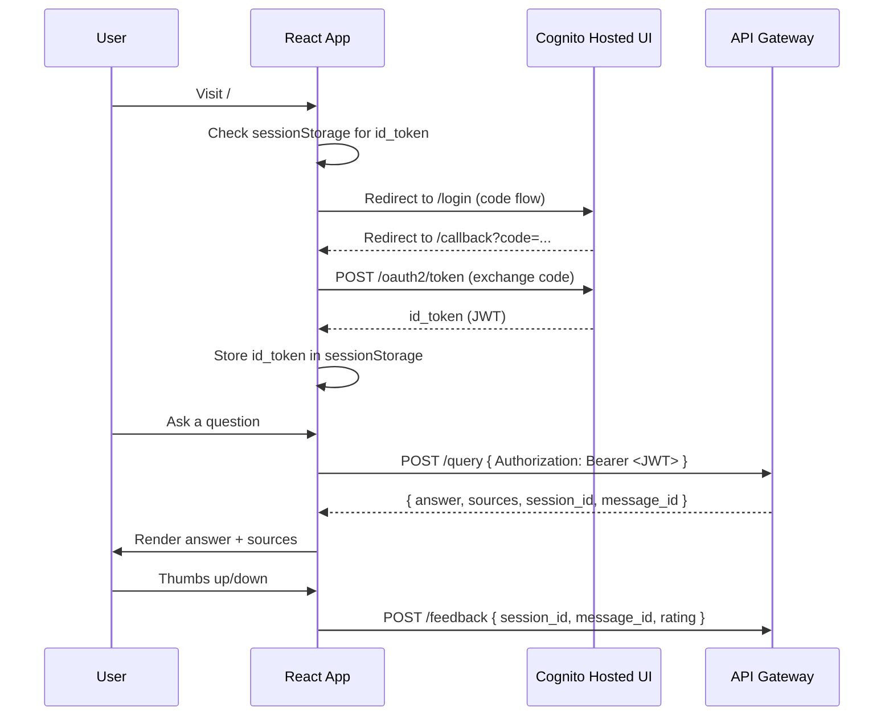

# Frontend — AWS RAG Chatbot

React 18 + Vite SPA. Authenticates users via Amazon Cognito (OAuth 2.0 authorization code flow), then streams questions to the RAG API and renders answers with cited sources and thumbs up/down feedback.

## Structure

```
frontend/
├── src/
│   ├── App.jsx               # Root component: auth gate, chat UI, session state
│   ├── api.js                # Typed fetch wrapper; injects Authorization header
│   ├── auth.js               # Cognito login / logout / token helpers
│   └── components/
│       ├── ChatMessage.jsx   # Renders a single message bubble (user or assistant)
│       └── Sources.jsx       # Collapsible sources panel with URLs
├── index.html
├── vite.config.js
└── package.json
```

## Auth Flow



## Environment Variables

Create `frontend/.env` (or set in CI):

```env
VITE_COGNITO_DOMAIN=https://<your-pool-domain>.auth.<region>.amazoncognito.com
VITE_COGNITO_CLIENT_ID=<cognito-app-client-id>
VITE_API_URL=https://<api-gateway-id>.execute-api.<region>.amazonaws.com
```

All three values are output by `terraform apply` — see `terraform/outputs.tf`.

Copy the example file:

```bash
cp .env.example .env
```

## Local Development

```bash
npm install
npm run dev      # http://localhost:5173
```

The dev server proxies nothing by default — point `VITE_API_URL` at a deployed API Gateway endpoint or set up a local mock.

## Build

```bash
npm run build    # outputs to dist/
npm run preview  # serve the production build locally
```

## Deploy to S3

After `terraform apply`, deploy the built assets:

```bash
BUCKET=$(terraform -chdir=../terraform output -raw site_bucket)
aws s3 sync dist/ s3://$BUCKET --delete
```

CloudFront serves the bucket through Origin Access Control (OAC). All 403s are rewritten to `index.html` for client-side routing.

## Security Notes

- `id_token` is stored in `sessionStorage` (cleared when the tab closes), not `localStorage`
- CORS is handled by API Gateway — no `Access-Control-Allow-Origin` headers are set by Lambdas
- The Cognito app client has no client secret (public client, PKCE code flow)
